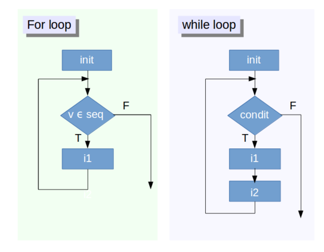

# Relational Operators  

Relational operators tell how one object relates to another. There are a variety of relational operators that you have used before in mathematics but take on a slightly different feel in computer science. We will walk through a few examples of different relational operators and the rest will be left as exercises.   

* __Equality & Inequality__: This type of operator tells whether an object is equivalent to another object (``==``), or its negation (``!=``).  

\vspace{0.1cm}

```{r equality}

TRUE == FALSE
-6*14 != 17-101
```

\vspace{0.5cm}

__Exercise 1__
```{r}
# write R code to see if 
    # "useR" and "user" are equal. 
    # TRUE and 1 are equal.

```

\vspace{0.5cm}

* __Greater & Less__: These statements should be familiar, with a bit of a notation twist. To write a strict greater than or less than statement you would use ``>`` or ``<`` in your statement. To add an equality constraint, you would add a ``=`` sign \underline{after} the inequality statement (``>=`` or ``<=``).  

\vspace{0.1cm}

```{r greaterLess}

-6 * 5 + 2 >= -10 + 1
```

__Exercise 2__  
```{r}
# write R code to see if
    # "raining" is less than or equal to "raining dogs". 
    # TRUE is greater than FALSE.
```

\vspace{0.5cm}

* __Matrices__: For matrices, the above relational statements can be applied across the entire matrix, or to a subset of the matrix (e.g. a vector). The relational statement is applied element wise (a step-wise progression through the entries).

\vspace{0.1cm}

```{r matricies}
# The following are dating data, of one person's messages received per day for one week

okcupid <- c(16, 9, 13, 5, 2, 17, 14)
match <- c(17, 7, 5, 16, 8, 13, 14)
messages <- matrix(c(okcupid, match), ncol = 2, byrow = FALSE)
# This makes the data from OkCupid the first column and the data from Match the second column
```

\pagebreak

__Exercise 3__  
```{r}
# Use the messages matrix to return a logical matrix that answers the following questions:


# For which days and sites were the messages equal to 13?


# For which days and sites were the number of messages less than or equal to 14? 
```

\vspace{0.5cm}

# Logicals  

These statements allow for us to change or combine the results of the relational statements we discussed before, using "and", "or", or "not". 

* __"and"__ statements evaluate to ``TRUE`` only if \underline{every} relational statement evaluates to ``TRUE``.   
    + ``(3 < 5) & (9 > 7)`` would evaluate to ``TRUE`` because \underline{both} relational statements are ``TRUE``  
    + ``(3 > 5) & (9 > 7)``, this would evaluate to ``FALSE`` as only one of the relational statements is ``FALSE`` (the first one)     
    

* __"or"__ statements evaluate to ``TRUE`` if  \underline{at least one} relational statement evaluates to ``TRUE``.  
    + ``(3 > 5) | (9 > 7)`` would evaluate to ``TRUE`` because \underline{one} of the relational statements is ``TRUE`` (the second one)  
    + ``(3 > 5) | (9 < 7)`` would evaluate to ``FALSE`` as \underline{both} relational statements evaluate to ``FALSE``   
    
    
* __Remark:__ The ``&&`` and ``||`` logical statements \underline{do not} evaluate the same as their single counterparts. Instead, these logical operators evaluate to ``TRUE`` or ``FALSE`` based \underline{only} on the first element of the statement, vector, or matrix.  

\vspace{1cm}

__Exercise 4__  

```{r logicals}
# Using the okcupid vector from above, answer the following questions:

# Is the last day of the week under 5 messages or above 10 messages? (hint: last <- tail(okcupid, 1) could be helpful)

# Is the last day of the week between 15 and 20 messages, excluding 15 but including 20?

```

\pagebreak

# Conditional Statements  

Conditional statements utilize relational statements and logical statements to change the results of your ``R`` code. You may have encountered an ``ifelse`` statement before (or not), but let's breakdown exactly what ``R`` is doing when it evaluates them.  

## If Statements  

First, let's start with an ``if`` statement, the often overlooked building block of the ``ifelse`` statement. The ``if`` statement is structured as follows:  

\begin{center}
\begin{verbatim}
if(condition){
              statement
}
\end{verbatim}
\end{center}

* the condition inside the parenthesis (a relational statement) is what the computer executes to verify if it is ``TRUE``,  
    + if the condition evaluates to ``TRUE`` then the statement inside the curly braces (``{}``) is output, and  
    + if the condition is ``FALSE`` nothing is output.  
    
__Remark:__ In `R` the `if` statement, as described above, will only accept a __single__ value (not a vector or matrix).       

## Else Statements  

Since whenever an ``if`` statement evaluates to ``FALSE`` nothing is output, you might see why an ``else`` statement could be beneficial! An else statement allows for another statement to be output whenever the ``if`` condition evaluates to ``FALSE``. The ``ifelse`` statement is structured as follows:  

\begin{center}
\begin{verbatim}
if(condition){
              statement1
}
else{
              statement2      
}
\end{verbatim}
\end{center}

* again, the ``if`` condition is executed first,  
    + if it evaluates to ``TRUE`` then the first statement (``statement1``) is output,
    + if the condition is ``FALSE`` the computer moves on to the ``else`` statement, and the second statement (``statement2``) is output. 

\vspace{0.25cm}

__Remark:__ ``R`` accepts both ``ifelse`` statements structured as outlined above, but also ``ifelse`` statements using the built-in ``ifelse()`` function. This function accepts __both singular and vector__ inputs and is structured as follows: 
\begin{center}
\begin{verbatim}
ifelse(condition, statement1, statement2),
\end{verbatim}
\end{center}

where the first argument is the conditional (relational) statement, the second argument is the statement (`statement1`) that is evaluated when the condition is ``TRUE``, and the third statement (`statement2`) is the statement that is evaluated when the condition is ``FALSE``.  

\pagebreak

## Else If Statements  

On occasion, you may want to add a third (or fourth, or fifth, ...) condition to your ``ifelse`` statement, which is where the ``elseif`` statement comes in. The ``elseif`` statement is added to the ``ifelse`` as follows:  

\begin{center}
\begin{verbatim}
if(condition1){
              statement1
}
elseif(condition2){
              statement2
}
else{
              statement3      
}
\end{verbatim}
\end{center}

* The ``if`` condition (`condition1`) is executed first,  
    + if it evaluates to ``TRUE`` then the first statement (``statement1``) is output,
    + if the condition is ``FALSE`` the computer moves on to the ``elseif`` condition,  
* Now the second condition (`condition2`) is executed, 
    + if it evaluates to ``TRUE`` then the second statement (``statement2``) is output,
    + if the condition is ``FALSE`` the computer moves on to the ``else`` statement, and 
* the third statement (``statement3``) is output. 

__Exercise 5__ 
```{r if, tidy = TRUE}
# Using the okcupid vector from above, write an if statement that prints "You're popular!" if the number of messages exceeds 10

```

__Exercise 6__
```{r else, tidy = TRUE}
# Using the if statement from Exercise 5 add the following else statement:  
    # When the if-condition on messages is not met, R prints out "Send more messages!" 

```

\pagebreak

# Loops  

Loops are a popular way to iterate or replicate a set of instructions many times. It is no more than creating an automated process by organizing a sequence of steps and grouping together the steps that need to be repeated. In general, the advice of many ``R`` users would be to learn about loops, but once you have a clear understanding of them to get rid of them. Loops will give you a detailed view of what is happening and the data you are manipulating. Once you have this understanding, you should put your effort into learning about vectorized alternatives as they pay off in efficiency. These loop alternatives (the ``apply`` and ``purrr`` families) will be covered in the _Simulation Workshop_.  

Typically in computer science, we separate loops into two types. The loops that execute a process a specified number of times, where the "index" or "counter" is incremented after each cycle are part of the ``for loop`` family. Other loops that only repeat themselves until a conditional statement is evaluated to be ``FALSE`` are part of the ``while`` family.



\pagebreak

## For Loops  

In the for loop figure above:   

* The rectangular `init` box represents the initialization of the object being used in the ``for loop`` (i.e. the variable). This initialization is \underline{required} in ``R``, as opposed to other languages, such as Python, where an initialization does not have to occur.  

* The diamond shapes represent the repeat decision the computer is required to make. The computer evaluates the conditional statement ($v \text{ in } seq$) as either ``TRUE`` or ``FALSE``. In other terms, you are testing if in the current value of $v$ is within the specified range of values $seq,$ where this range is defined in the initialization (like 1:100).  

* The second `i1` rectangle represents the set of instructions to execute for every iteration. This could be a simple statement, a block of instructions, or another loop (nested loops).  

The computer marches through this process until the the statement evaluates to ``FALSE`` ($v \text{ not in } seq$).  

### Notation  

The ``for loop`` instructions are placed between curly braces, which are placed directly after the test condition or beneath it. You will find the formatting that you like best for things such as loops and functions, but here is my preferred syntax:  

\begin{center}
\begin{verbatim}
for(i in 1:n){
              statement
}
\end{verbatim}
\end{center}

\vspace{0.25cm}

_Example:_

```{r forloop, eval = FALSE}
sim <- 100
# Define a counter variable to determine how many t-values to use

u <- rt(sim, 32)
# Draw sim random t-values, from a t-distribution with 32 degrees of freedom 

# Initialize `usq` (could have used a single NA or 0 initialization)
usq <- rep(NA, sim)

for(i in 1:sim) {
  # i-th element of `u1` squared into i-th position of `usq`
  usq[i] <- u[i]^2
  print(c(u[i], usq[i]))
}

print(i) ## should be 100 (the same as sim), unless the loop had issues!
```

\begin{verbatim}
[1] 0.13559322 0.01838552
[1] 0.21768730 0.04738776
[1] -0.3459573  0.1196864
.
.
.
\end{verbatim}

__Remark:__ It is often useful, when writing a loop to add a ``print()`` output inside. This allows for you to verify that the process is executing correctly and can save you some major headaches!

\pagebreak

### Nesting For Loops  

Now that you know that for loops can also be nested, you're probably wondering when and why you would be using this in your code.

Well, suppose you wish to manipulate a matrix by setting its elements to specific values, based on their row and column position. You will need to use nested ``for loops`` in order to assign each of the matrix's entries a value. 

* The index `i` runs over the rows of the matrix  

* The index `j` runs over the columns of the matrix  

\vspace{1cm}

```{r}
# Create a 30 x 30 matrix (of 30 rows and 30 columns)
mymat <- matrix(nrow = 30, ncol = 30)

# verify the dimensions of mymat
dim(mymat)

# pull off number of rows for first loop
dim(mymat)[1]

# pull off number of columns for second loop
dim(mymat)[2]


# For each entry in the matrix: assign values based on its position (the product of two indices)
for(i in 1:dim(mymat)[1]){
  for(j in 1:dim(mymat)[2]){
    mymat[i,j] <- i*j
  }
}

# Just show the upper left 13x13 piece 
mymat[1:13, 1:13]
```

\pagebreak

## While Loops  

The ``while loop`` takes on a similar structure as the ``for loop``, except that the diamond block can now be __any__ conditional statement. In a ``for loop``, the only job of this block was to verify that the "counter" of the loop ($i$ or $j$) was still in the specified range, and did not require you to construct a conditional statement. 

Instead, we now have a relational statement to check, which is typically expressed using a relational statement between a "control variable" and a value.   


* If the result of the relational statement is ``FALSE``, the loop is never executed (similar to the "counter" being outside the sequence of numbers). 

* If the result of the relational statement is ``TRUE``, the block of instructions `i1` is executed, and 
    + the "control variable" is updated in `i2`.  
    

\vspace{0.1cm}

For example, here is how we could rewrite the first for loop as a while loop:  

\vspace{0.5cm}

```{r while}
sim <- 100
u <- rt(sim, 32)


usq <- 0  # Initialize `usq`

i <- 1  # Initialize the "control variable"

# verifying a relational statement, checking if i is STRICTLY less than 100 (sim)
while(i < sim){
  # i-th element of `u1` squared into `i`-th position of `usq`
  usq[i] <- u[i]^2
  i <- i + 1
}
```

\vspace{0.5cm}

__How is the `usq` output from the above `while loop` different from the `usq` from the previous `for loop`?__

\pagebreak

# Functions  

What is a function? In rough terms, a function is a set of instructions that you would like repeated (similar to a loop), but are more efficient to be self-contained in a sub-program and called upon when needed. A function is a piece of code that carries out a specific task, accepting arguments (inputs), and returning values (outputs).  Many different programming languages fuss over function terminology, but in ``R``, a function is a function!  

In ``R`` the function you define (or use) will have the following construction:

\begin{center}
\begin{verbatim}
functionName <- function(argument1, argument2, ...){
                body
}
\end{verbatim}
\end{center}

At this point, you may be familiar with a smattering of ``R`` functions in a few different packages (e.g. `lm`, `glm`, `ggplot`, `diffmean`, etc.). Some of these functions take multiple arguments and return multiple outputs, but the best way to learn about the inner workings of functions is to write your own!  

## User Defined Functions  

Often, you will be in the position where you need to perform a task, but you do not know of a function or a library that would help you. You could spend time Googling for a solution, but in the amount of time it takes you to find something you could have already written your own function!   

The function you build will have the same form as described above, where you select the name of the function, the arguments, and the outputs. Some important advice on writing your own functions:  

* Make sure that the name you choose for your function \underline{is not} a reserved word in ``R`` (`mean`, `sd`, `hist`, etc.).
    + A way to avoid this is to use the help directory to see if that function name already exists (``?functionName``).  
* It is possible to overwrite the name of an existing function, but it is \underline{not} recommended!  

\vspace{1cm}

_Examples:_  
Here are some functions that I wrote. Let's look them over and find each of the following:  

* what are the arguments?  

* what are the outputs?  

* what is being performed in the body of the function?  

__Example 7__

\begin{center}
\begin{verbatim}
fahr_to_kelvin <- function(temp){
                    kelvin <- ((temp - 32) * (5 / 9)) + 273.15
                    return(kelvin)
}
\end{verbatim}
\end{center}

* Arguments:  

* Outputs:  

* Body:  

\pagebreak

__Example 8__

\begin{center}
\begin{verbatim}
dataCenter <- function(data, new_center){
            # returns a new vector containing the original data centered around the desired value
            new_data <- (data - mean(data)) + new_center
            return(new_data)
}
\end{verbatim}
\end{center}

  

* Arguments:  

* Outputs:  

* Body: 

\vspace{1cm}


__Example 9__ Write a function that computes the condition index for a given fish 

$$ \text{condition index} = \frac{\text{weight}^{\frac{1}{3}}}{\text{length}} * 50$$  

The function should take two arguments (a length and a weight)  

\vspace{0.25cm}

```{r function}
## function code here!


```

\vspace{1cm}

__Example 10: Putting it All Together!__

```{r, eval = FALSE}

matrix <- data.frame(NA, l = BlackfootFish$length, w = BlackfootFish$weight)

```

\vspace{0.25cm}

Now, given the matrix of integers above,  
    1. use a ``for loop``,    
    2. an ``ifelse`` statement, and  
    3. the function you defined above,  
    
to compute the condition number of each fish, and remove that fish from the dataset if it's condition is NA or greater than 2.

\pagebreak

# References  

https://www.datacamp.com/community/tutorials/functions-in-r-a-tutorial#gs.5ySzPg0

https://www.datacamp.com/community/tutorials/tutorial-on-loops-in-r

